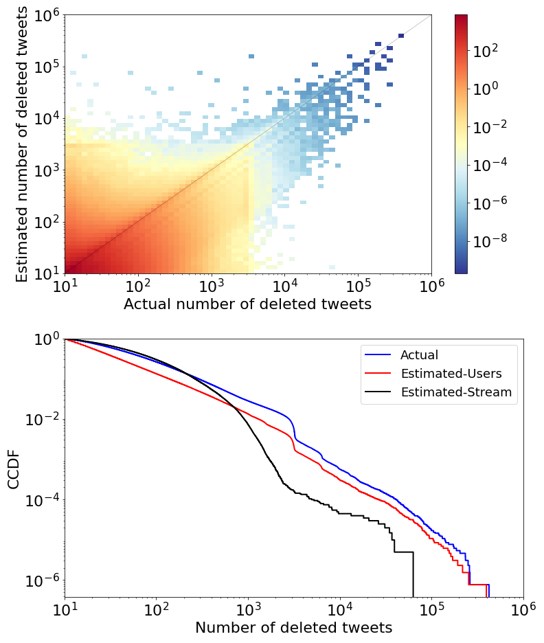

## Deletion Estimation Code
[Manipulating Twitter through Deletions](https://ojs.aaai.org/index.php/ICWSM/article/view/19355/19127)

Authors: Christopher Torres-Lugo*, Manita Pote*, Alexander C. Nwala, and Filippo Menczer

This repo contain the code for the deletion estimation part of the paper.

### Abstract
Research into influence campaigns on Twitter has mostly relied on identifying malicious activities from tweets obtained via public APIs. These APIs provide access to public tweetsthat have not been deleted. However, bad actors can delete content strategically to manipulate the system. Unfortunately,estimates based on publicly available Twitter data underestimate the true deletion volume. Here, we provide the first exhaustive, large-scale analysis of anomalous deletion patterns involving more than a billion deletions by over 11 million accounts. We find that a small fraction of accounts delete a largenumber of tweets daily. We also uncover two abusive behaviors that exploit deletions. First, limits on tweet volume are circumvented, allowing certain accounts to flood the network with over 26 thousand daily tweets. Second, coordinated networks of accounts engage in repetitive likes and unlikes of content that is eventually deleted, which can manipulate ranking algorithms. These kinds of abuse can be exploited to amplify content and inflate popularity, while evading detection. Our study provides platforms and researchers with new methods for identifying social media abuse.

### Estimation Method For Deletion
Let us denote by $d^i_a(\Delta t)$ and $d^i_e(\Delta t)$ the actual and estimated *daily* numbers of tweets deleted by account $i$ during time $\Delta t$, respectively (in our data, the maximum time resolution is $\Delta t = 1$ day). For the simple case in which tweet counts are available for two consecutive days $t$ and $t+1$, if $n^i(t+1) < n^i(t)$ and the true deletion count is above 10 for the interval $(t, t+1)$, we can use:

$$
d^i_e(\Delta t) = n^i(t) - n^i(t+1).
$$

Note that we only estimate the number of deleted tweets for accounts and days such that Eq.~(1) yields a positive estimate; as explained above, we cannot infer any deletions otherwise.

There are two more complicated "gap" cases such that $\Delta t = t_2 - t_1 > 1$:  
1. We may not have actual deletion counts for one or more consecutive days, either because the account did not delete any tweets, or because they deleted fewer tweets than our threshold of 10; and/or  
2. We may not have tweet counts for one or more consecutive days, because the account was suspended.  

In both of these cases, we are still able to estimate the daily number of deleted tweets by considering the last day $t_1$ when a tweet count was available (the account was active), and the first day $t_2$ when the tweet count and actual deletion data are both available:

$$
d^i_e(\Delta t) = \frac{n^i(t_1) - n^i(t_2)}{t_2 - t_1}
$$

where $n^i(t_1) > n^i(t_2)$.

### Result

